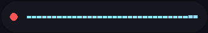
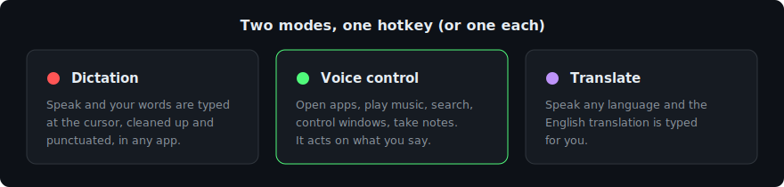
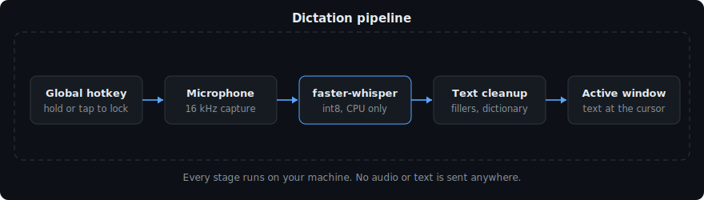
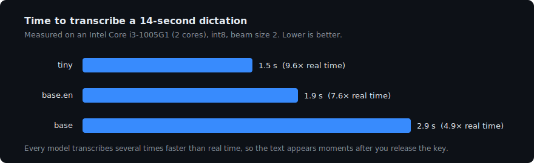
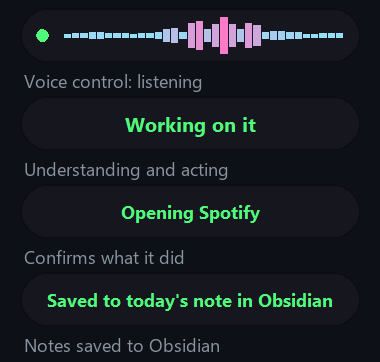
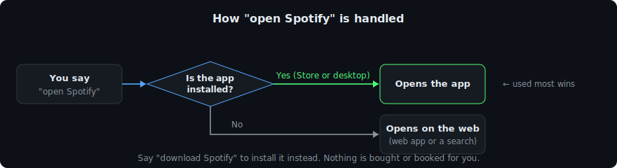
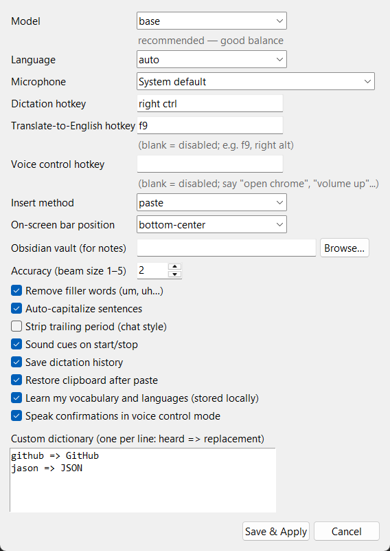
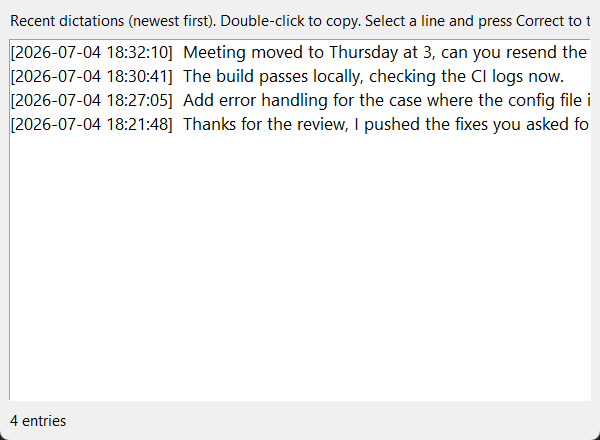
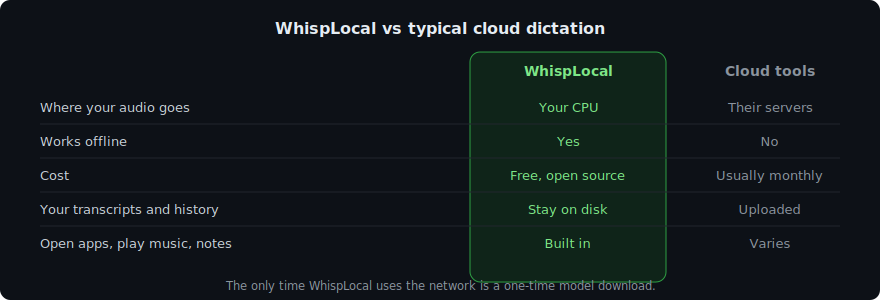

<p align="center">
  
</p>

<p align="center">
  <a href="https://github.com/ROHITCRAFTSYT/WhispLocal/actions/workflows/ci.yml"></a>
  
  
  
  
</p>

WhispLocal is a voice tool for Windows that runs entirely on your own
computer. Hold a key and talk: in dictation mode your words are typed at
the cursor, and in voice control mode it opens apps, plays music,
searches, and takes notes. There is no cloud service behind it. Speech
recognition runs on your CPU, so nothing you say or do is uploaded.

<p align="center">
  
</p>

## Two modes

<p align="center">
  
</p>

Switch modes from the tray, or give each one its own hotkey and use them
side by side. Dictation is the default; voice control turns the same key
into a command trigger.

## What it can do

- Type into any app: browsers, editors, chat, terminals.
- Hold to talk, or tap once to lock recording on for longer stretches.
- A live waveform shows your real mic level while recording.
- Clean up as you go: filler words removed, sentences capitalized, plus
  a personal dictionary of corrections.
- Speak other languages, or translate them to English on a second hotkey.
- Voice control: open apps (including Microsoft Store apps), play music,
  web and YouTube search, close and manage windows, type and press keys,
  volume and media control, screenshots, lock screen, take notes.
- Learns your vocabulary, languages, and habits over time, all locally.
- Runs from the tray with a silent launch. No console window, ever.

## Dictation

```
hotkey → mic capture (16 kHz) → faster-whisper (int8, CPU) → cleanup
(fillers, dictionary, punctuation) → text at the cursor in any app
```

<p align="center">
  
</p>

Audio is transcribed by [faster-whisper](https://github.com/SYSTRAN/faster-whisper),
a CTranslate2 build of Whisper quantized to int8 so it runs well on CPUs
without a GPU. A cleanup pass fixes spacing and capitalization and
applies your dictionary (for example `jason => JSON`), then the text is
pasted at the cursor and your previous clipboard is restored.

### Speed

<p align="center">
  
</p>

Measured on a two-core laptop CPU (Intel i3-1005G1) with no GPU, so this
is close to a worst case. The model stays in RAM between dictations, so
only the first one after startup waits for it to load.

| Model | 14 s dictation takes | Notes |
|---|---|---|
| `tiny` / `tiny.en` | 1.5 s | Fastest, makes more mistakes |
| `base` / `base.en` | 1.9 to 2.9 s | Default, good balance |
| `small` / `small.en` | about 7 s (estimated) | Most accurate |

The `.en` variants are English only. Translate mode needs a multilingual
model (no `.en` suffix). Picking a model you have not used before
downloads it once, the only time the app touches the network.

### Other languages

Pick your language from the tray or Settings rather than relying on
auto-detection; it is faster and more reliable for short clips. For
Hindi, Bengali, Tamil, Telugu, Marathi, Gujarati, Urdu, and Punjabi,
WhispLocal prompts the model in the native script, so you get देवनागरी
rather than a Latin transliteration.

## Voice control

Switch to voice control from the tray (Mode menu), or set a separate
hotkey in Settings and keep dictating on the main one. Confirmations are
spoken back through the built-in Windows voice.

<p align="center">
  
</p>

Commands are matched locally. Apps are found by indexing both your Start
Menu shortcuts and your installed Microsoft Store apps, so "open Spotify"
opens the Spotify app whether it came from the Store or a normal
installer.

<p align="center">
  
</p>

| Say | Happens |
|---|---|
| "open obs", "launch discord" | Opens the app if installed (fuzzy matching included) |
| "open youtube which is already open", "switch to spotify" | Jumps to the open window instead of a duplicate |
| "open spotify" (not installed) | Opens the web version instead |
| "open spotify in web" | Forces the web version even if the app is installed |
| "download spotify" | Opens its official download page |
| "close chrome", "quit spotify" | Closes the app gracefully (save prompts still appear) |
| "play some music" | Opens YouTube Music |
| "play despacito", "play X on spotify" | Plays the song on YouTube Music or Spotify |
| "stop the music", "pause music", "resume" | Media transport (play/pause) |
| "search youtube for lofi", "search cats on youtube" | YouTube results |
| "louder", "quieter", "turn it up" | Volume control |
| "what's open", "list windows" | Lists your open windows (spoken) |
| "help", "what can you do" | Lists what you can say |
| "search for python tutorials", "look up the capital of Japan" | Web search |
| "find market data for Tesla", "stock price of Apple" | Opens the market page |
| "book a table at Bukhara" | Opens reservation options (you confirm it) |
| "take a note buy milk tomorrow" | Saves a formatted note to your Obsidian vault |
| "what do you know about me" | Writes a profile of what it has learned to Obsidian |
| "type hello there" | Types the text at the cursor |
| "press control shift s", "press enter" | Sends the key combination |
| "volume up", "mute", "next song", "pause" | Audio and media control |
| "close window", "maximize", "switch window" | Window management |
| "scroll down", "click", "right click" | Pointer control |
| "take a screenshot" | Saves a PNG to Pictures |
| "lock the screen" | Locks Windows |
| "shut down the computer" | Shutdown after 60 s; "cancel shutdown" aborts |
| "what time is it", "what's the date" | Answers on screen and out loud |

If something is already open, "open X" brings it to the front rather than
launching a duplicate or searching for it, and it ignores the extra words
people add ("open youtube which is already open" just means YouTube).

If a command is slightly misheard, WhispLocal makes a second pass: it
corrects the leading verb ("oben chrome" becomes "open chrome") or
matches the whole phrase to the closest known command before giving up.
Common names like Claude, GitHub, and OBS are recognized as names rather
than similar-sounding words, and your own command words and app names are
fed into the recognizer, so it hears you better the more you use it.

It stays out of your way on purpose. It will not delete files, and it
will not make purchases, payments, or bookings for you: booking and
market commands open the right page so you finish the action yourself.
Closing an app is a graceful request, so unsaved work still prompts you.
See [GUARDRAILS.md](GUARDRAILS.md) for the full list.

## It learns, locally

WhispLocal keeps a small profile in `adaptive.json` and gets more
accurate the more you use it:

- Words and app names you use often become recognition hints, so names
  and jargon a generic model would fumble start coming out right.
- Teach it a correction from the History window and it applies that fix
  automatically from then on.
- It notices which languages you dictate in and, when detection is
  unsure, retries with your usual one.
- When a spoken name matches more than one app, the one you open most
  wins.

Say "what do you know about me" and it writes a `Profile.md` to your
Obsidian vault, refreshed automatically as you go. This is a
personalization layer on top of the recognizer, not neural-network
training (which no laptop CPU could do). It stays on your disk, can be
turned off in Settings, and deleting `adaptive.json` resets it.

## Notes go to Obsidian

Point WhispLocal at your [Obsidian](https://obsidian.md) vault in
Settings and say "take a note ..." in voice control mode. Notes are
appended to a dated file in a `WhispLocal` folder in your vault, with
frontmatter and timestamped bullets:

```markdown
---
created: 2026-07-05
source: WhispLocal
tags: [whisplocal, voice-note]
---

# Voice notes — 2026-07-05

- **18:32** Buy milk tomorrow.
- **18:41** Call Dr. Mehta about the report.
```

The writer only ever touches files inside the vault folder you chose.

## Settings and history

Everything is a normal window, not a config file to edit by hand.

<table>
  <tr>
    <td align="center"></td>
    <td align="center"></td>
  </tr>
  <tr>
    <td align="center">Settings</td>
    <td align="center">History (double-click to copy, Correct to teach)</td>
  </tr>
</table>

The recording bar defaults to the bottom-center of the screen; Settings
has a position option with seven placements if it gets in the way.

## Why local

<p align="center">
  
</p>

## Install

```
git clone https://github.com/ROHITCRAFTSYT/WhispLocal.git
cd WhispLocal
setup.bat
install_shortcuts.bat
```

You need Windows 10 or 11 and [Python 3.11+](https://www.python.org/downloads/).
`setup.bat` creates a virtual environment, installs dependencies, and
downloads the default model (about 75 MB). `install_shortcuts.bat` adds
WhispLocal to your Desktop and Start Menu. Launch it from the Start Menu
and look for the microphone icon in the tray. Launching it twice is safe;
the second copy just tells you it is already running.

To start it at login, press `Win+R`, type `shell:startup`, and copy the
WhispLocal shortcut into that folder.

## Privacy

- Transcription happens on your CPU. No telemetry, no account, no network
  requests while running.
- Models download from Hugging Face once, when you first select them.
  Nothing is uploaded.
- History (`history.jsonl`), the learning profile (`adaptive.json`), and
  Obsidian notes are plain local files. Turn any of them off in Settings
  or delete the files whenever you want.
- The default insert method briefly uses the clipboard and restores it.
  The `type` method avoids the clipboard entirely.
- See [GUARDRAILS.md](GUARDRAILS.md) for exactly what voice control will
  and will not do.

## Development

```
venv\Scripts\python.exe -m unittest discover -s tests
```

The suite covers text cleanup, the personalization engine, the command
parser and app matching, and the Obsidian writer. `debug.bat` runs the
app with a console attached; errors also go to `whisp.log`, which rotates
itself. Pull requests welcome.

## Troubleshooting

- Text does not appear in some apps: programs running as Administrator
  ignore input from normal processes. Run WhispLocal as administrator too.
- An app blocks pasting: switch the insert method to `type` in Settings.
- Wrong microphone: pick the right one in Settings.
- A command opens the web when the app is installed: give it a moment
  after startup to finish indexing your apps, then try again.
- It will not start: run `debug.bat` and read the error, or check
  `whisp.log`.

## License

[MIT](LICENSE) © ROHITCRAFTSYT
